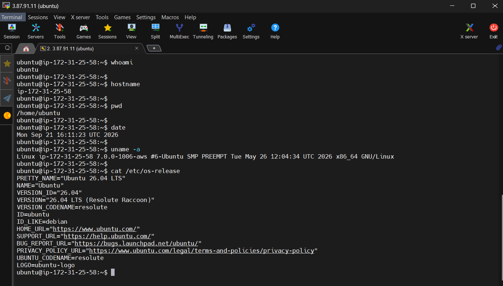
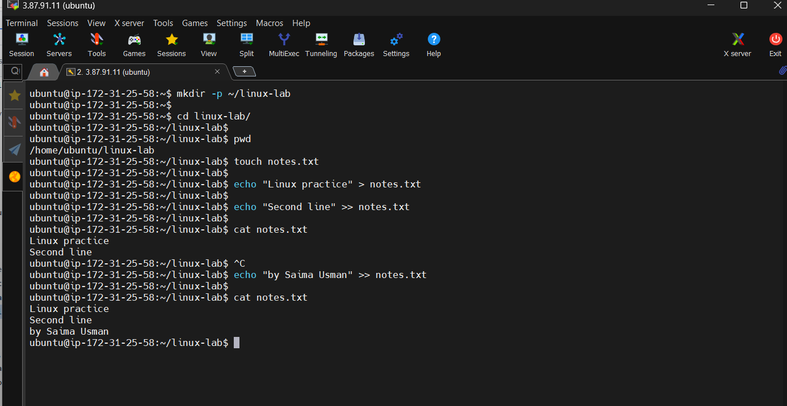
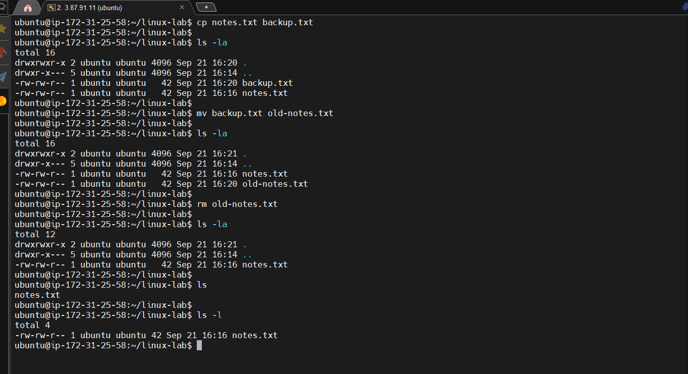

# 01 - Linux Basics

## Goal

Practice essential Linux commands, directory navigation, file creation, and file operations.

## Key concepts

- `pwd` shows the current directory.
- `ls` lists directory contents.
- `cd` changes directories.
- `mkdir` creates directories.
- `touch` creates an empty file.
- `cat` displays file contents.
- `cp` copies files.
- `mv` moves or renames files.
- `rm` removes files.
- `>` overwrites a file; `>>` appends to a file.

## Why `pwd` matters

Make `pwd` a habit before important file operations. It confirms exactly where a relative path will be interpreted.

---

## Practice

Type `commands.sh` commands manually rather than blindly executing every line. Read each command first.

### Identity and system information

### Directory navigation

### Create and read files

