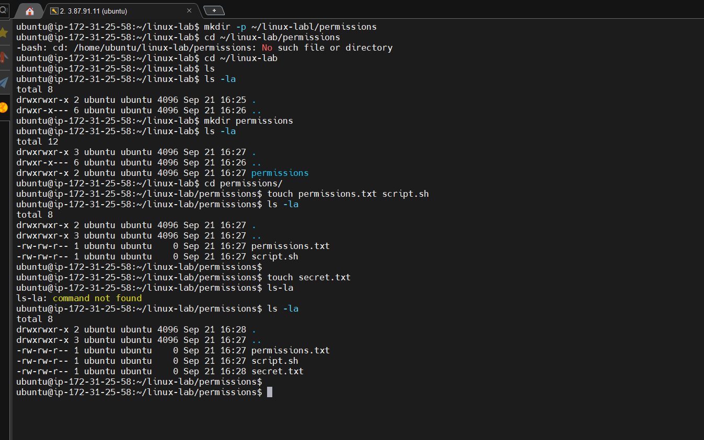
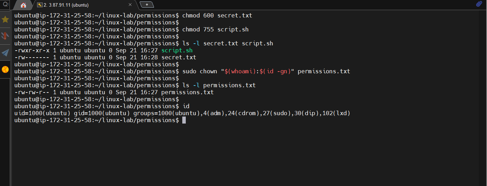

# 02 - Files and Permissions

## Goal

Understand Linux ownership and permission bits.

## Permission values

| Value | Permission |
|---|---|
| 4 | read |
| 2 | write |
| 1 | execute |

Common modes:

- `600` = owner read/write; nobody else has access.
- `644` = owner read/write; group and others read.
- `755` = owner read/write/execute; group and others read/execute.

## Commands

`chmod` changes permissions.

`chown USER:GROUP FILE` changes ownership.

Use `ls -l` to inspect permissions and ownership.

## Warning

Only use `sudo chown` and `chmod` on files you created for this lab unless you specifically understand the system file you are changing.

---

## Practice

### Ownership/Permissions

