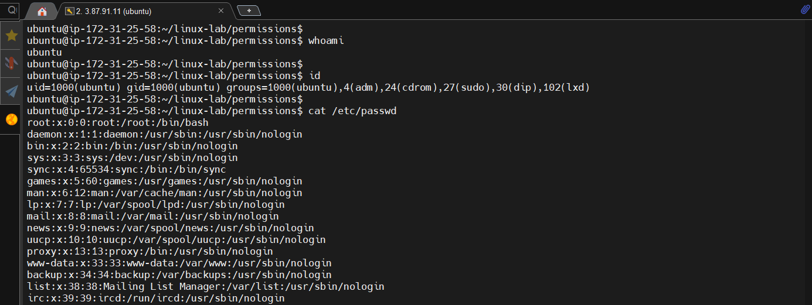
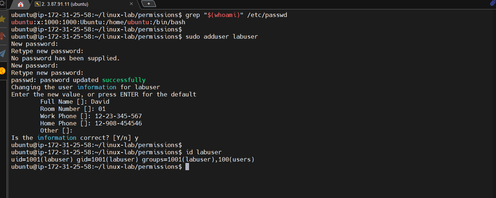
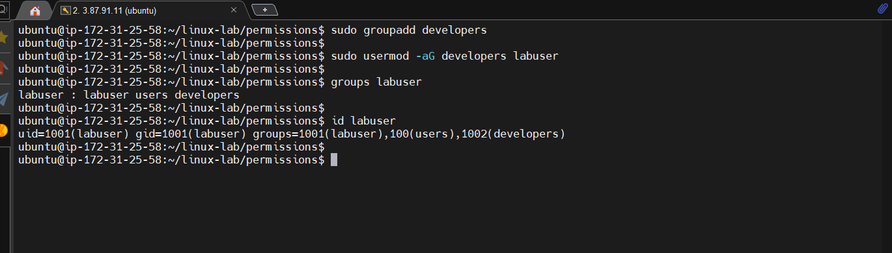
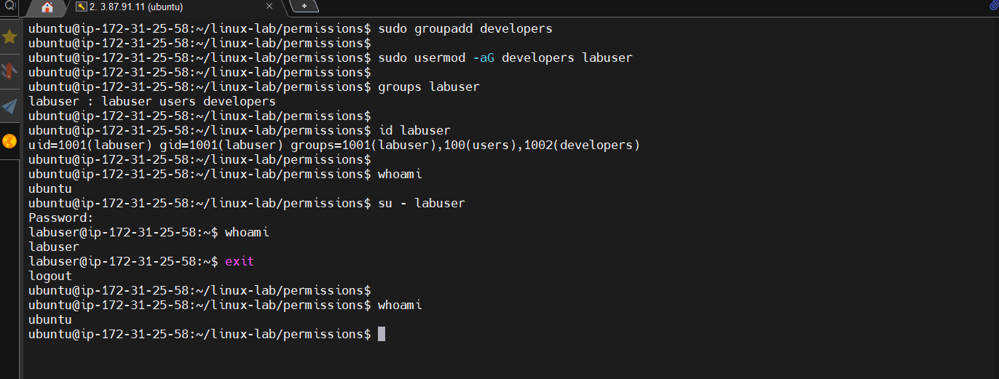

# 03 - Users and Groups

## Goal

Practice inspecting users, creating a test user, creating a group, and adding the user to the group.

## Key commands

- `whoami` identifies the current user.
- `id` shows UID, GID, and group membership.
- `adduser` creates a user interactively.
- `groupadd` creates a group.
- `usermod -aG` appends a supplementary group.
- `groups` displays group membership.
- `su - USER` opens a login shell as another user.

## Important flag

For `usermod -aG developers labuser`:

- `-a` = append; keep existing supplementary groups.
- `-G` = specify supplementary groups.

Do not omit `-a` when you intend to add rather than replace supplementary group membership.

---

## Practice

### Users/Group/Membership

 

### Create a test user

 

### Create a test group & Add the test user to the supplementary group

 

### switch to the test user

