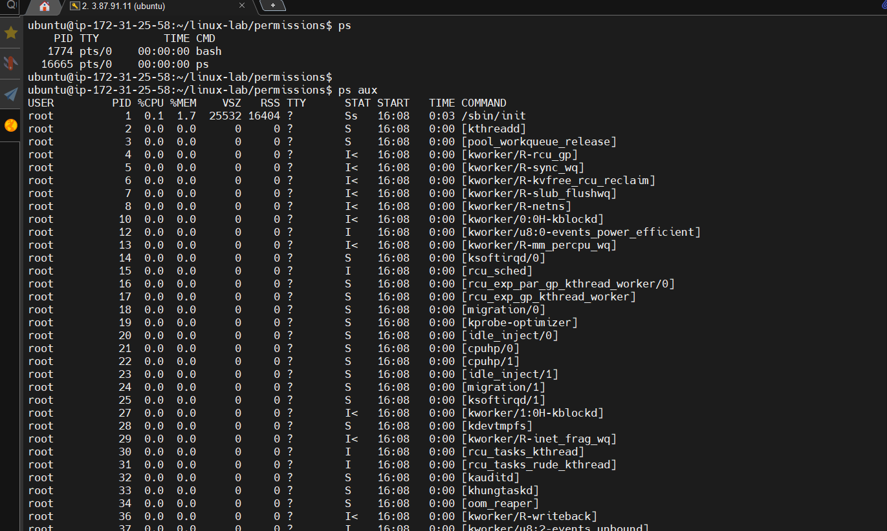
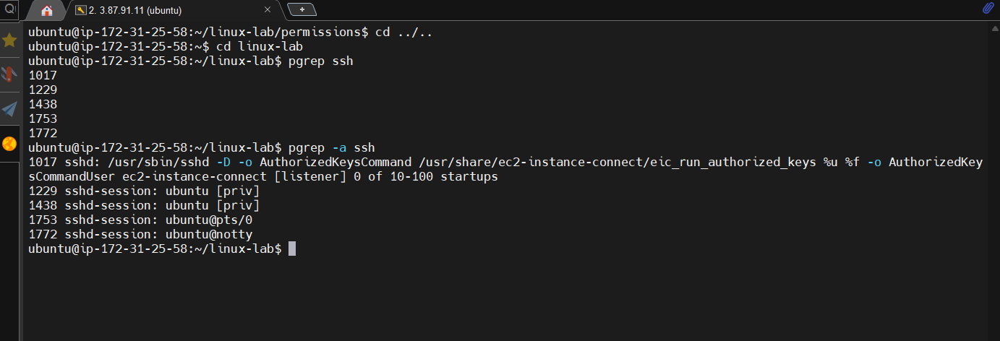
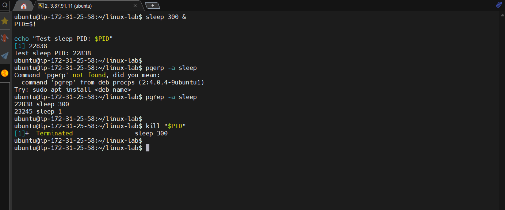
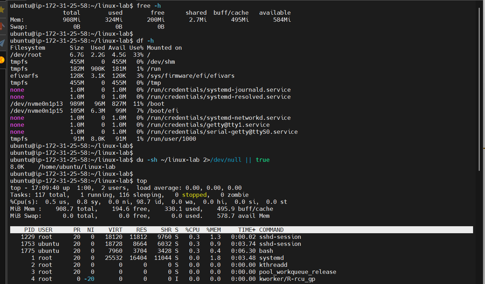
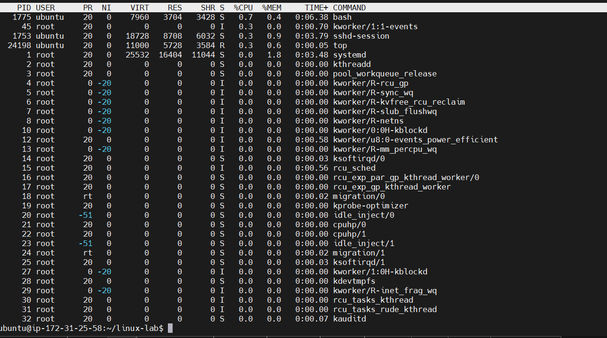

# 04 - Process Management

## Goal

Learn how to list processes, find PIDs, run background processes, terminate processes, and inspect system resources.

## What is a PID?

A PID is a Process ID: a number assigned by Linux to identify a running process.

## Finding a PID

```bash
pgrep process_name
```

For example:

```bash
pgrep ssh
pgrep -a ssh
```

The `-a` option includes the command line.

## Important commands

- `ps` lists processes.
- `ps aux` shows processes in a detailed format.
- `pgrep` searches for process IDs.
- `kill PID` sends a termination signal.
- `top` provides a live process view.
- `free -h` shows memory usage.
- `df -h` shows filesystem space.
- `du -sh DIRECTORY` shows directory size.

Only terminate processes you understand and own, or processes you have been instructed to manage.

---

## Practice

### List processes



<br>

### Search for SSH processes




<br>

### Start a harmless test process in the background

Start a harmless test process in the background



<br>

### System resource checks



