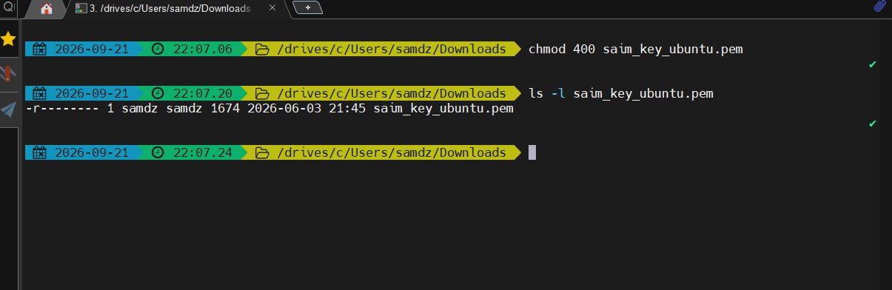
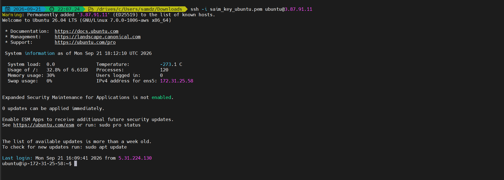
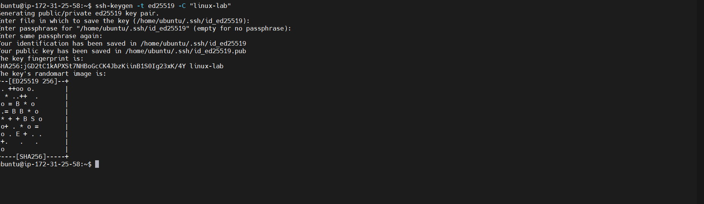
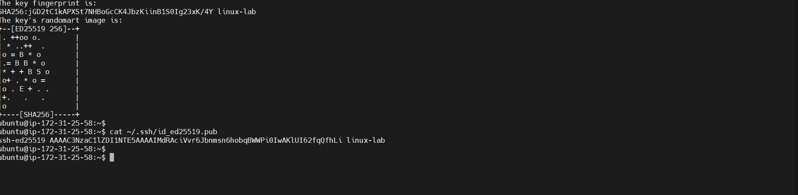

# 06 - SSH

## Goal

Understand secure remote administration and SSH key permissions.

## Connecting to the AWS EC2 server

From your local computer:

```bash
chmod 400 my-key.pem
ssh -i my-key.pem ubuntu@YOUR_PUBLIC_IP
```

### Flags

- `chmod 400` makes the private key readable only by its owner.
- `ssh` starts an SSH connection.
- `-i` specifies the identity/private key file.
- `ubuntu` is the usual Ubuntu EC2 login username.
- `YOUR_PUBLIC_IP` is the EC2 instance's public IPv4 address.

## Generate a separate practice key

```bash
ssh-keygen -t ed25519 -C "linux-lab"
```

- `-t` selects the key type.
- `ed25519` is the key algorithm.
- `-C` adds a comment.

Never commit private keys to GitHub.

---

## Practice

### Protect the EC2 private key on your local



<br>

### Connect to EC2 from LOCAL machine



<br>

### Generate a practice Ed25519 key on a machine where you control the private key



<br>

### Inspect the public key.




❌ Never display, upload, or commit the private key:
