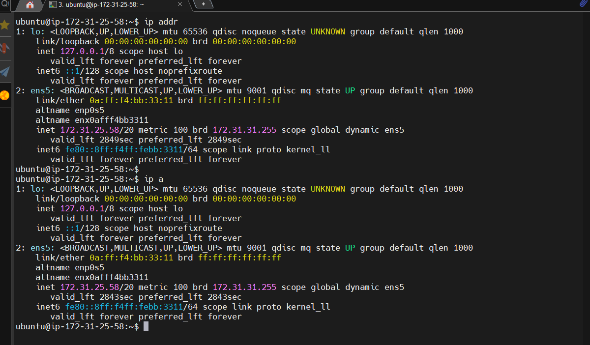
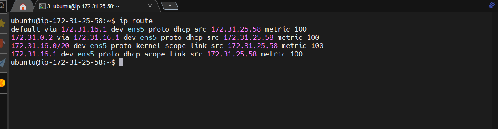
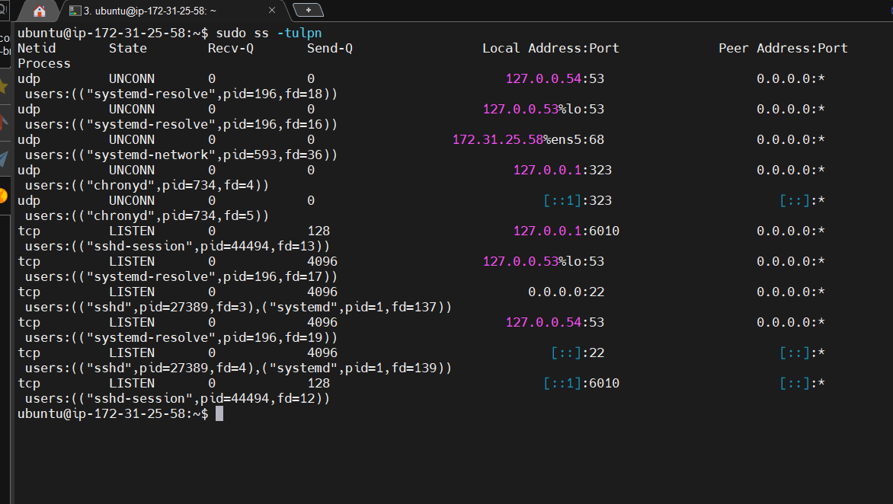
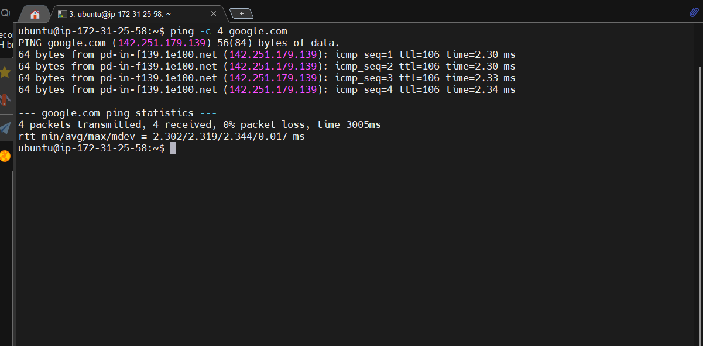
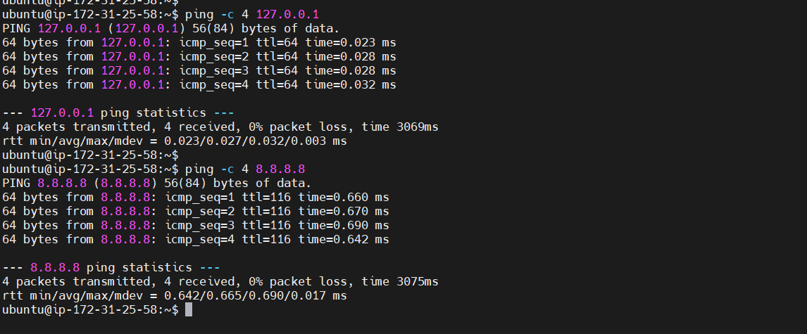
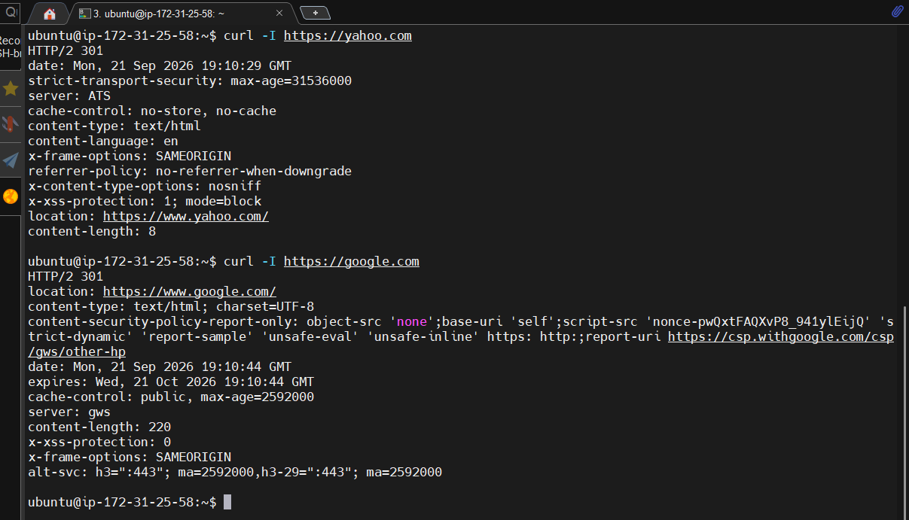

# 07 - Networking

## Goal

Inspect IP addresses, routes, listening ports, and basic network connectivity.

## Key commands

- `ip addr` / `ip a` shows network interfaces and IP addresses.
- `ip route` shows routing information.
- `ss -tulpn` shows listening TCP/UDP sockets and processes.
- `ping -c 4 HOST` tests reachability with four packets.
- `curl` makes HTTP requests.

## `ss -tulpn` flags

- `-t` TCP
- `-u` UDP
- `-l` listening
- `-p` process information
- `-n` numeric output without name resolution

Port 80 is the default HTTP port used by Nginx in this lab.

---

## Practice

### IP addresses and interfaces

 

### Routing table

 

### Listening TCP/UDP ports

 

### Connectivity tests

 

### HTTP requests

