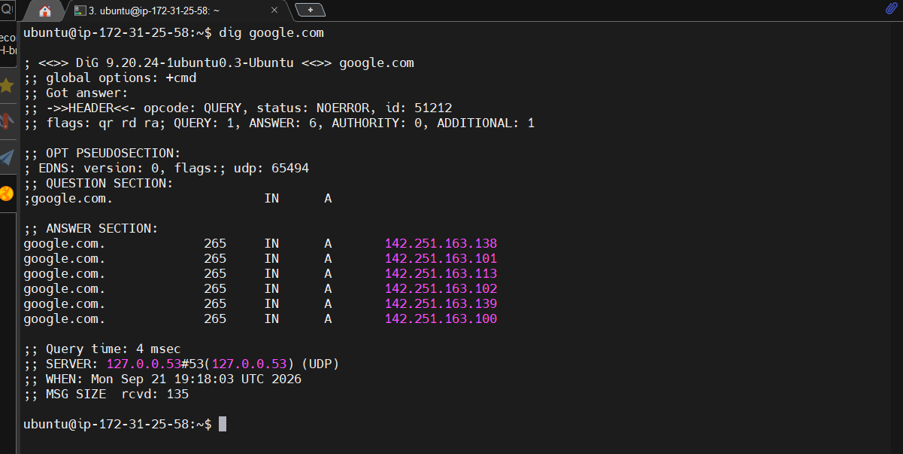
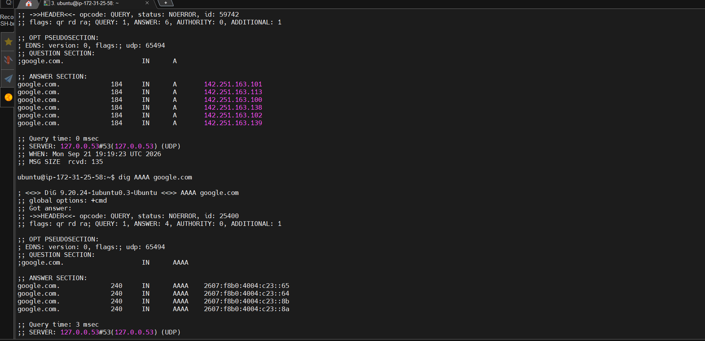

# 08 - DNS

## Goal

Understand how domain names are resolved to IP addresses.

## DNS concepts

DNS translates names such as `google.com` into IP addresses and can provide other record types.

Common records:

- `A` = IPv4 address
- `AAAA` = IPv6 address

## Commands

`getent hosts` uses the system's configured name service mechanisms.

`dig` provides detailed DNS query output.

If `dig` is not installed:

```bash
sudo apt update
sudo apt install dnsutils
```

DNS resolution is separate from whether a service is reachable on a particular port.

----

## Practice

### System name resolution


<br>

### DNS queries




