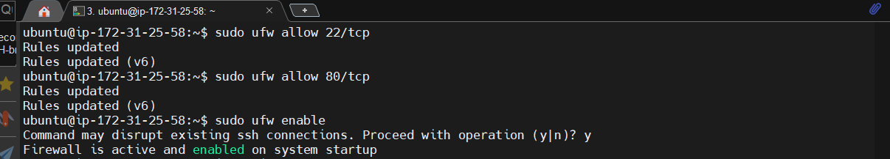
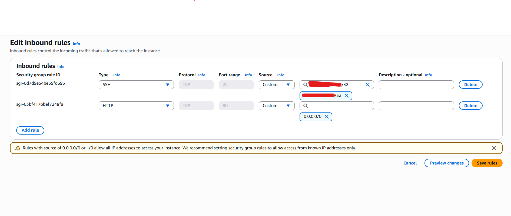
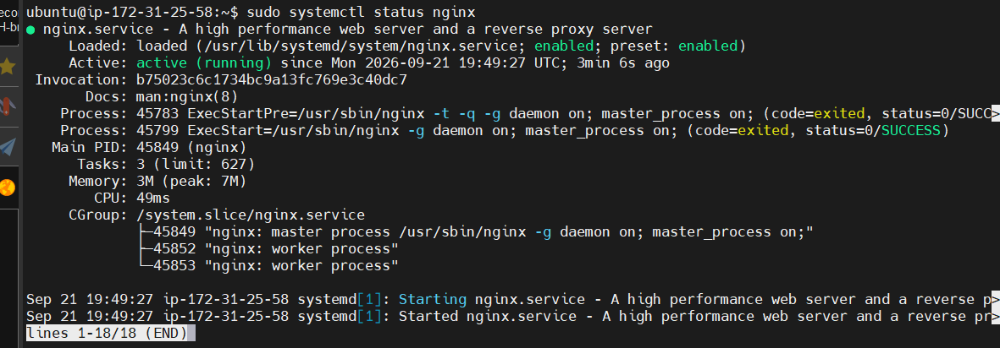
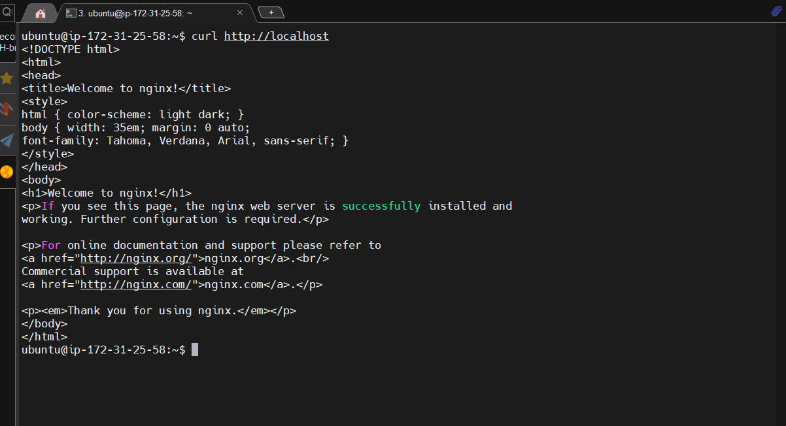
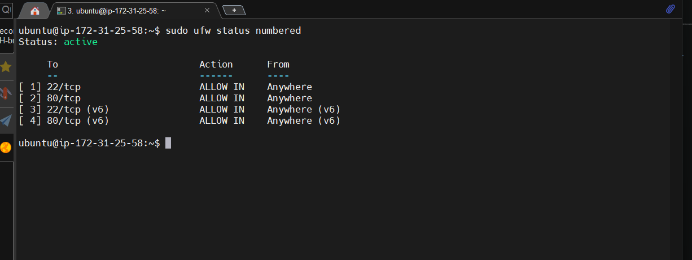

# 09 - UFW Firewall

## Goal

Configure the Ubuntu host firewall while keeping remote SSH access available.

## What is UFW?

UFW means **Uncomplicated Firewall**. It is a simpler command-line interface for managing firewall rules on Ubuntu.

## Critical EC2 rule

Before enabling UFW on a remote server, allow SSH:

```bash
sudo ufw allow 22/tcp
```

Then allow HTTP for Nginx:

```bash
sudo ufw allow 80/tcp
```

Finally:

```bash
sudo ufw enable
```




Check:

```bash
sudo ufw status verbose
```


----

## Lab architecture

```text
Internet
   |
AWS Security Group
   |
Ubuntu EC2
   |
UFW
   |
Nginx
```

The AWS Security Group and UFW are separate security layers.

## UFW and CIDR

UFW can also use network sources, but this lab mainly demonstrates CIDR through the AWS Security Group. The Security Group should restrict SSH to your public IP using `/32`.

## STEPS

### 1. Find your public IP

On your local Windows/Git Bash terminal, run:

```
ipconfig 

# OR

curl ifconfig.me
```

Your CIDR for SSH will be:

```
**.***.**.**/32
```

/32 means only this one IP address is allowed.


### 2. Configure AWS Security Group

`AWS Console → EC2 → Security Groups → select the Security Group attached to your EC2`




### 3. Connect to your EC2

From your local machine:

```
ssh -i my_key.pem ubuntu@<EC2-PUBLIC-IP>
```

#### How it will work?

```
Internet
    │
    ▼
AWS Security Group
    │
    ├── SSH :22 → YOUR_PUBLIC_IP/32 only
    │
    └── HTTP :80 → Anywhere
    │
    ▼
Ubuntu EC2
    │
    ▼
UFW
    │
    ├── :22 → ALLOW
    │
    └── :80 → ALLOW
    │
    ▼
Nginx
```


### 4. Install Nginx

EC2 Termial:

```
sudo apt install nginx -y

sudo systemctl status nginx

curl http://localhost

```





### 5. Test from local machine

```
http://<EC2-PUBLIC-IP>
```


### 6. Verify the firewall configuration

```
sudo ufw status numbered
```


---

AWS Security Group = external/cloud firewall layer \

UFW = host-level firewall layer.