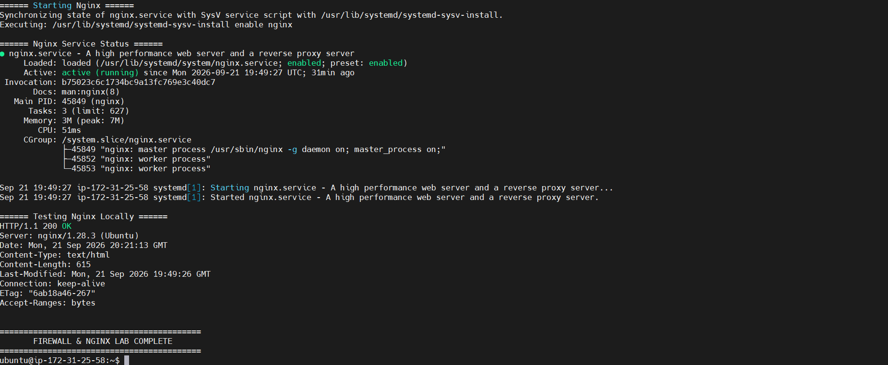
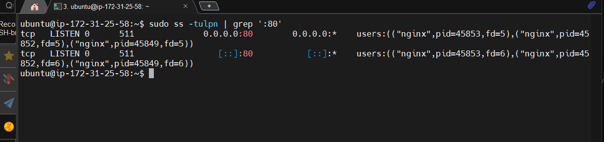
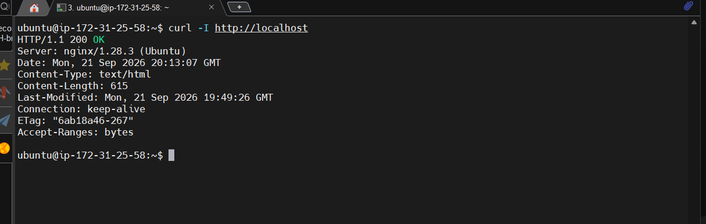
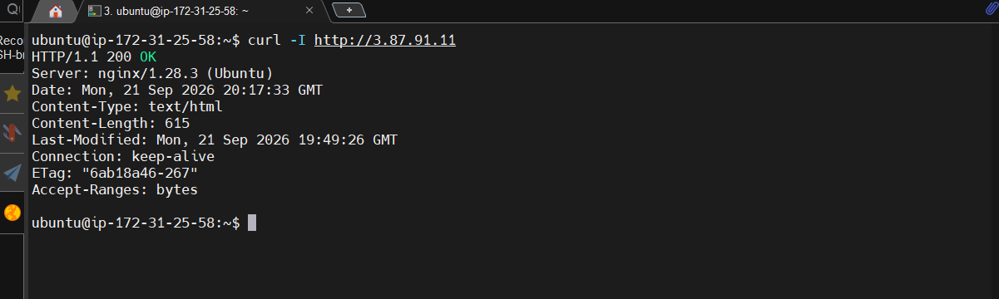
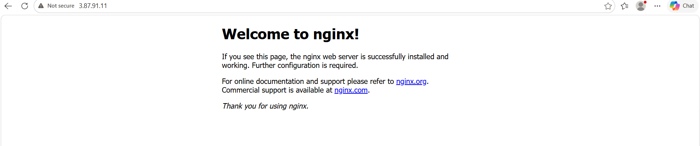

# 11 - Nginx Service

## Goal

Install a Linux service and verify connectivity without building a custom website.

## Install Nginx

```bash
sudo apt update
sudo apt install nginx
```

## Manage the service

```bash
sudo systemctl status nginx
sudo systemctl enable --now nginx
sudo systemctl is-active nginx
sudo systemctl is-enabled nginx
```



## Verify port 80

```bash
sudo ss -tulpn | grep ':80'
```



## Test locally

```bash
curl http://localhost
curl -I http://localhost
```




## Test using the public IP

From the EC2 server:

```bash
curl -I http://YOUR_PUBLIC_IP
```



From your local browser:

```text
http://YOUR_PUBLIC_IP
```


The expected result is the **default Nginx welcome page**.

## Scope note

Do not modify `/var/www/html/index.html` for this phase. A default Nginx page is sufficient to demonstrate that:

1. The package was installed.
2. The service is running.
3. Nginx is listening on port 80.
4. UFW permits HTTP.
5. The AWS Security Group permits HTTP.
6. The server is reachable from the Internet.
